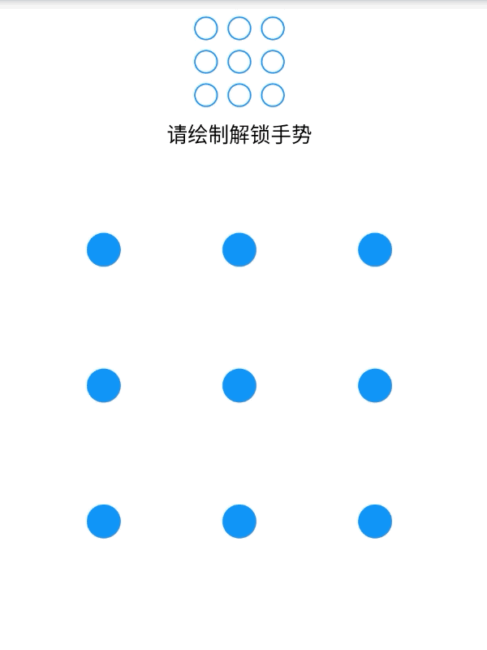
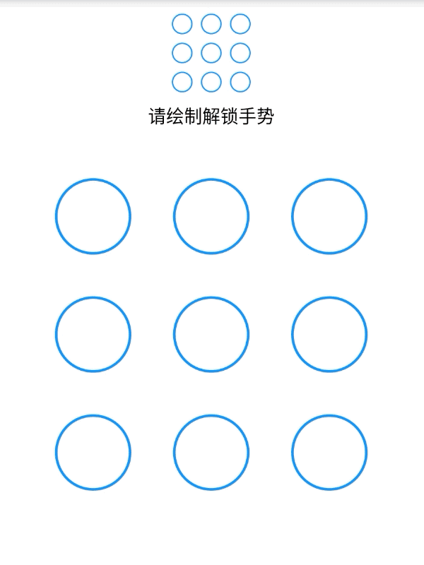

# GestureUnlock

Flutter gesture unlock project<br>

[](https://pub.dartlang.org/packages/gesture_unlock)
[](https://github.com/codingfd/GestureUnlock)<br>

### Preview
<div class="half">
    
        <span> &nbsp;&nbsp;&nbsp;&nbsp;&nbsp;&nbsp;&nbsp;&nbsp;&nbsp;&nbsp;&nbsp;&nbsp;&nbsp;&nbsp;&nbsp;  </span>
    
</div>

### Add dependency
```yaml
dependencies:
  gesture_unlock: ^0.0.1
```
### simple to use 
Refer to [this](https://github.com/codingfd/GestureUnlock/blob/master/example/lib/gesture_create.dart)   


## License

[Apache License 2.0](https://github.com/codingfd/GestureUnlock/blob/master/LICENSE)

Copyright (c) 2018-2019 codingfd
